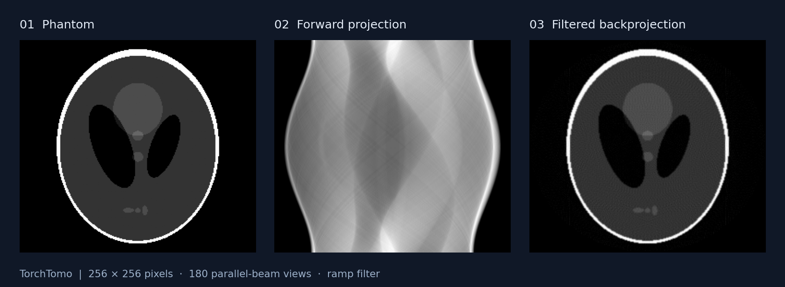

# TorchTomo

**Differentiable 2D computed tomography in PyTorch — from projection to learned reconstruction and geometry calibration.**

[](https://pypi.org/project/torchtomo/)
[](https://pypi.org/project/torchtomo/)
[](https://github.com/itu-biai/torchtomo/actions/workflows/test.yml)
[](LICENSE)

TorchTomo provides parallel-beam and flat-detector fan-beam projectors, exact
discrete adjoints, and filtered backprojection (FBP). Use the same API on **CPU,
NVIDIA CUDA, and Apple Silicon (MPS)**, with gradients through images, sinograms,
and scan geometry. The default backend uses PyTorch operations; optional CUDA
kernels compile at first use with no separate build step.

[Quick start](#quick-start) · [Operators](#operators-and-tensor-shapes) ·
[Geometry gradients](#learn-the-scan-geometry) · [Backends](#choose-a-backend) ·
[Benchmarks](#benchmarks-and-examples) · [Implementation notes](docs/advanced.md)



*256 × 256 Shepp–Logan phantom, 180 parallel-beam views, ramp-filtered reconstruction.
Generated with TorchTomo’s CPU backend.*

## Why TorchTomo?

- **Start with two dependencies:** PyTorch and NumPy; `pip install torchtomo` installs the library.
- **Build reconstruction networks:** batched `nn.Module` projectors and autograd support for learned primal-dual and other unrolled methods.
- **Use a matched operator pair:** `adjoint()` is the transpose of the implemented `forward()`, up to floating-point roundoff in exact mode.
- **Optimize the scanner geometry:** learn view angles, detector shifts, and fan-beam source shifts and distances as tensors.
- **Accelerate on CUDA:** optional runtime-compiled kernels for forward projection, adjoint, FBP, and first-order geometry gradients.
- **Experiment immediately:** built-in phantoms and six FBP filters: `ramp`, `shepp-logan`, `cosine`, `hamming`, `hann`, and `none`.

## Installation

Requires **Python 3.10+**. Install a PyTorch build appropriate for your device, then:

```bash
pip install torchtomo
```

The default `backend="torch"` needs no compiler. The optional CUDA backend uses
NVRTC from a CUDA-enabled PyTorch installation; it does not require a separate
`nvcc` build or an additional Python dependency.

## Quick start

### Parallel beam

```python
import torch
from torchtomo import ParallelBeam, shepp_logan

device = torch.device("cuda" if torch.cuda.is_available() else "cpu")
image = shepp_logan(size=256, device=device)  # [1, 1, 256, 256]
projector = ParallelBeam(
    img_size=256, n_angles=180, n_det=256, backend="auto"
).to(device)

sinogram = projector(image)                          # [1, 1, 180, 256]
reconstruction = projector.fbp(sinogram, filter_name="ramp")
print(reconstruction.shape)                          # torch.Size([1, 1, 256, 256])
```

To use Apple Silicon, set `device = torch.device("mps")` when
`torch.backends.mps.is_available()`. Move both the projector and its inputs to
the same device and dtype.

### Fan beam

```python
from torchtomo import FanBeam, shepp_logan

image = shepp_logan(size=256)
projector = FanBeam(img_size=256, n_angles=360, backend="auto")
sinogram = projector(image)                          # [1, 1, 360, 384]
reconstruction = projector.fbp(sinogram, filter_name="hann")
```

Fan beam uses a flat detector. At size 256, the defaults are 384 detector bins
and source-to-isocentre and isocentre-to-detector distances of 512 pixels.
Set `n_det`, `src_dist`, `det_dist`, and `det_spacing` or `det_width` for a
specific acquisition.

## Operators and tensor shapes

Images are square, single-channel tensors; the leading dimension batches independent slices.

| Tensor | Shape |
| --- | --- |
| Image | `[batch, 1, img_size, img_size]` |
| Sinogram | `[batch, 1, n_angles, n_det]` |
| Parallel-beam pose | `[n_angles, 2]`: angle, detector shift |
| Fan-beam pose | `[n_angles, 3]`: angle, detector shift, source shift |
| Fan-beam distances | `[3]`: source distance, detector distance, detector width |

| Operation | Meaning | Typical use |
| --- | --- | --- |
| `projector(image)` / `forward(image)` | Forward projection, $A x$ | Simulate measurements; compute data consistency |
| `adjoint(sinogram)` / `backward(sinogram)` | Exact discrete transpose, $A^T y$, in exact mode | Iterative reconstruction; learned primal-dual updates |
| `backproject(sinogram)` | Analytical backprojection with angular normalization and geometry weights | Analytical reconstruction |
| `fbp(sinogram, filter_name="ramp")` | Filtering followed by analytical backprojection | Reconstruct a sinogram; initialize a network |

The discrete adjoint satisfies

```math
\langle A x, y \rangle = \langle x, A^T y \rangle
```

up to floating-point roundoff. Analytical `backproject()` includes different
interpolation and normalization, so use `adjoint()` when an algorithm requires
the transpose of the forward operator.

Angles are in **radians**, and lateral shifts and fan-beam distances are in
**pixels**. Default views cover `[0, π)` for parallel beam and `[0, 2π)` for fan
beam, without repeating the endpoint. Supply `angles=` for explicit views.
`circle=True` masks the image to its inscribed circle; fan-beam rays remain
clipped to the unit circle even with `circle=False`.

## Differentiate through reconstruction

Both projection and adjoint operations participate in autograd. This example
computes an image gradient from a measurement-space loss:

```python
import torch
import torch.nn.functional as F
from torchtomo import ParallelBeam, shepp_logan

projector = ParallelBeam(img_size=64, n_angles=90)
measurements = projector(shepp_logan(size=64)).detach()
image = torch.zeros(1, 1, 64, 64, requires_grad=True)

loss = F.mse_loss(projector(image), measurements)
loss.backward()
print(image.grad.shape)  # torch.Size([1, 1, 64, 64])
```

`projector.adjoint(y)` also differentiates with respect to `y`, so gradients
reach the dual network in a learned primal-dual update. `projector.backward(y)`
is its equivalent operator method; `loss.backward()` is PyTorch’s autograd call.

## Learn the scan geometry

Each view has a pose tensor. With `learnable_geometry=True`, it becomes an
`nn.Parameter` that an optimizer can update. Fan beam also registers its
`distances` tensor as a parameter.

```python
import torch
from torchtomo import ParallelBeam, shepp_logan

reference = ParallelBeam(img_size=64, n_angles=90)
reference.set_pose(detector_shift=3.0)
measurements = reference(shepp_logan(size=64)).detach()

projector = ParallelBeam(img_size=64, n_angles=90, learnable_geometry=True)
optimizer = torch.optim.Adam(projector.parameters(), lr=0.05)

optimizer.zero_grad()
reconstruction = projector.fbp(measurements)
loss = (projector(reconstruction) - measurements).square().mean()
loss.backward()
print(projector.pose.grad.shape)  # torch.Size([90, 2])
optimizer.step()
```

This demonstrates one optimization step. For a full centre-of-rotation recovery
experiment, run [`benchmark/calibrate_geometry.py`](benchmark/calibrate_geometry.py).
For measured scans and motion correction, see the
[geometry benchmarks](https://github.com/itu-biai/torchtomo-benchmark/tree/main/geometry).

Fixed calibrated geometry can be written with `set_pose(...)` and, for fan
beam, `set_distances(...)`. Pose and distances are saved in the state dict.
See [the geometry notes](docs/advanced.md#differentiable-geometry) for gradients,
checkpoint compatibility, and measured calibration results.

## Choose a backend

| Backend | Geometries | Execution |
| --- | --- | --- |
| `"torch"` (default) | Parallel, fan | PyTorch operations on CPU, CUDA, or MPS |
| `"auto"` | Parallel, fan | Selects `"cuda"` when NVRTC loads; otherwise `"torch"` |
| `"cuda"` | Parallel, fan | Runtime-compiled kernels for float32 CUDA tensors; PyTorch fallback for other devices/dtypes or unavailable NVRTC |
| `"triton"` | Parallel | Optional fused Triton kernels where supported; PyTorch fallback otherwise |

```python
from torchtomo import ParallelBeam

projector = ParallelBeam(img_size=512, n_angles=360, backend="auto")
print(projector.backend)  # Backend selected at construction
```

The CUDA backend compiles kernels on first use and caches them under
`~/.cache/torchtomo`. Set `TORCHTOMO_KERNEL_CACHE` to override the directory;
an empty value disables the disk cache. Geometry gradients on CUDA kernels
support first-order differentiation; use the PyTorch path for higher orders.

`approximate=True` with `"cuda"` or `"auto"` trades the exact transpose pair for
faster texture interpolation and pixel-driven backprojection. Keep the default
`False` for algorithms that depend on adjoint consistency. The
[implementation notes](docs/advanced.md) explain this tradeoff, Triton geometry
fallbacks, sparse adjoints, and the parallel-beam grid-cache budget.

## Benchmarks and examples

Recorded **0.4.0** operator timings: 512 × 512, batch 4, 360 views, RTX 2080 Ti,
PyTorch 2.4.0+cu121. Mean milliseconds per call after three warmups, over 20 calls:

| Geometry | Backend | Forward | Adjoint | FBP |
| --- | --- | ---: | ---: | ---: |
| Parallel | PyTorch | 17.852 | 37.426 | 14.292 |
| Parallel | CUDA, exact | 2.196 | 1.963 | 0.635 |
| Fan | PyTorch | 16.089 | 50.901 | 14.891 |
| Fan | CUDA, exact | 2.720 | 2.983 | 1.095 |

These are measurements on one setup. Find the configurations, raw JSON,
reconstruction figures, and comparisons with LEAP, torch-radon, and ASTRA in
[torchtomo-benchmark’s 0.4.0 results](https://github.com/itu-biai/torchtomo-benchmark/blob/main/libraries/results/0.4.0/README.md).

The library’s own experiments need only its dependencies:

```bash
make benchmark-speed      # Available devices and backends
make benchmark-adjoint    # 500 inner-product pairs in float64
make benchmark-calibrate  # Recover a simulated 3 px axis offset
make benchmark-angles     # Learn a 12-view sampling pattern
```

See [`benchmark/README.md`](benchmark/README.md) for details. The companion
[torchtomo-benchmark](https://github.com/itu-biai/torchtomo-benchmark) repository
also provides classical, supervised, and self-supervised reconstruction
pipelines on ellipse phantoms and CT slices, plus measured-scan calibration.

## Upgrading existing code

- **`backward()` computes the exact discrete adjoint.** Use `backproject()` to retain the earlier analytical-backprojection behavior. Models trained with the earlier operator may need retraining or step-size retuning.
- **Version 0.3 changed the FBP ramp filter.** FBP-based results from older versions are not directly comparable with current results.
- **Version 0.4 adds differentiable geometry.** Older checkpoints that stored only `angles` still load with `strict=True`.

Details and the recorded before/after measurements are in the
[migration and implementation notes](docs/advanced.md).

## Development and contributions

```bash
git clone https://github.com/itu-biai/torchtomo.git
cd torchtomo
python -m venv .venv
source .venv/bin/activate
pip install -e ".[dev]"
make test
make lint
make build
```

Bug reports and contributions are welcome through
[GitHub issues](https://github.com/itu-biai/torchtomo/issues) and pull requests.
For an operator issue, include your TorchTomo/PyTorch versions, device, dtype,
geometry, backend, and a minimal reproducible example. CI tests Python 3.10–3.13;
release publishing is configured in [`.github/workflows/`](.github/workflows).

## License and attribution

Developed by **BIAI Lab**. TorchTomo is licensed under
[Creative Commons Attribution–NonCommercial 4.0 International](LICENSE).
Non-commercial use, sharing, and adaptation require attribution. Commercial use
by third parties requires prior written permission from the authors.

For attribution, link this repository and state the version or commit used.
