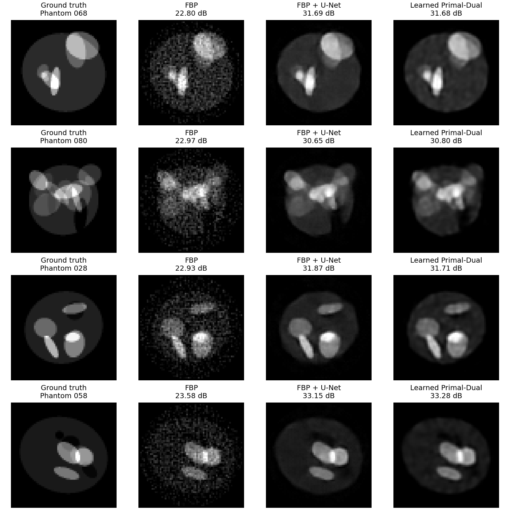
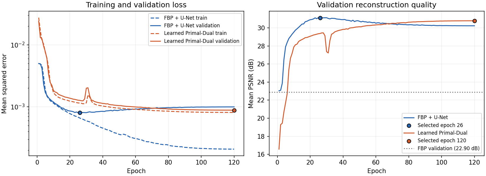

# Ellipse reconstruction example

Generate 100 different ellipse phantoms, split them into 60 training, 20 validation,
and 20 test images, and compare:

- **FBP:** TorchTomo's ramp-filtered backprojection, with no trainable parameters.
- **FBP + U-Net:** a residual U-Net trained on the noisy FBP images.
- **Learned Primal-Dual:** an unrolled network trained directly on the same noisy
  sinograms, using TorchTomo's matched `forward()` / `backward()` pair.

This example uses PyTorch and Matplotlib, which are already in the project's
runtime and development dependencies, respectively. It adds no dependencies or
experiment tracking service. Python `logging` writes progress to the console and
`results/training.log`.

## Run

From the repository root, in the existing development environment:

```bash
PYTHONPATH=src .venv/bin/python examples/ellipses/train.py
```

The default run uses CPU, four threads, and 120 epochs for each network. To change
the run configuration, use a separate output directory:

```bash
PYTHONPATH=src .venv/bin/python examples/ellipses/train.py \
    --unet-epochs 120 --lpd-epochs 120 --device cpu \
    --output /tmp/torchtomo-ellipses
```

`--device cuda` and `--device mps` are also available when supported by your
PyTorch installation. Phantom generation and Poisson sampling always take place
on CPU with explicit seeds. Training results can vary across devices and versions.

After training, reload the saved dataset and best checkpoints, recompute test
metrics, and regenerate the PNG files without retraining:

```bash
PYTHONPATH=src .venv/bin/python examples/ellipses/train.py --evaluate-only
```

Use `--help` for image size, angle count, batch size, learning rate, seed, and
target FBP PSNR options. A training run regenerates its output files; use a new
`--output` directory to retain an earlier experiment.

## Data and noise

The default geometry is parallel-beam CT with 90 angles, 64 detectors, and 64 × 64
images. Each phantom contains a low-intensity body ellipse and 6–12 independently
drawn bright/dark ellipses. Images are rendered at three times the resolution and
averaged to pixels, restricted to the circle support, and scaled into [0, 1].
The generated ellipse parameters and exact split indices are saved.

For clean line integrals $p = Ax$, the transmission noise model is:

```math
N \sim \mathrm{Poisson}(I_0 e^{-p}), \qquad
y = -\log\left(\frac{\max(N, 1)}{I_0}\right).
```

Only zero photon counts are floored. Negative post-log samples are retained.
The incident photon count $I_0$ is calibrated on the **60 training images only**
to give approximately 23 dB mean FBP PSNR. A fresh, fixed Poisson realization is
then generated for all images and shared across the three methods. Calibration
does not consult validation or test targets. This is a transmission Poisson
model, rather than adding Poisson-distributed values to a sinogram. See the
[LPD paper's transmission model](https://arxiv.org/html/1707.06474v3).

PSNR is computed separately for each full image with a fixed data range of 1,
then averaged across the split. Reconstructions are **not clipped for training
or metrics**. PNGs use a common [0, 1] display range. Test images are evaluated
after both networks finish and their checkpoints have been selected.

## Networks and training

Both models minimize image MSE with Adam, batch size 5, initial learning rate
0.001, cosine decay to 0.00001, and gradient norm clipping at 1. The checkpoint
with the lowest validation MSE is selected separately for each network. Each
epoch logs training MSE, validation MSE, validation PSNR, learning rate, elapsed
time, and the best epoch. There is no data augmentation or noise resampling.

The U-Net has two downsampling levels, skip concatenations, widths 16/32/64, and
118,305 trainable parameters. It predicts a residual correction to the cached,
unclipped FBP image. Its initial correction is zero.

LPD has five iterations, five primal and five dual memory channels, and separate
three-layer convolutional update blocks with width 24 at each iteration. It has
77,690 trainable parameters. Both states start at zero; **LPD receives no FBP**.
Its updates follow the memory-based structure of
[Adler and Öktem's Learned Primal-Dual method](https://arxiv.org/html/1707.06474v3),
using fewer iterations and narrower blocks for this small example. It uses
$\bar{A}=A/\|A\|$, $\bar{A}^T=A^T/\|A\|$, and $\bar{y}=y/\|A\|$, with the norm
estimated by power iteration on the geometry. Both sides receive the same scale,
so the adjoint relation is preserved. Gradients pass through the projection and
adjoint at every iteration; the first batch checks gradients reach the earliest
primal and dual update blocks.

## Recorded run

The included results use the default seed 2026, CPU, PyTorch 2.10.0, Python
3.11.16, and 120 epochs per network. Calibration selected **960.333 incident
photons per ray**. The fresh noisy dataset gave 22.969 dB training FBP and
22.896 dB validation FBP. Test-set results use the selected checkpoints:

| Method | Test PSNR, mean ± population std | Test MSE | Selected epoch | Training time |
| --- | ---: | ---: | ---: | ---: |
| FBP | 22.95 ± 0.38 dB | 0.0050853 | — | — |
| FBP + U-Net | 31.48 ± 1.33 dB | 0.0007504 | 26 | 54 s |
| Learned Primal-Dual | 31.36 ± 1.50 dB | 0.0007808 | 120 | 420 s |

Both networks improved by more than 8 dB over FBP on this split. Their test means
are close, with U-Net ahead by 0.11 dB. The U-Net validation loss reached its
minimum before its training loss stopped improving, so the selected checkpoint
is from epoch 26 rather than the final epoch. LPD improved through the end of
the configured schedule. This is a small synthetic example with different model
sizes, rather than a general ranking of the two architectures.

## Outputs

- `gt.png`, `fbp.png`, `fbp-unet.png`, `lpd.png`: all 20 test images, in identical
  row-major order, with five columns. IDs appear in `metrics.json` and `splits.json`.
- `comparison.png`: the first four test images side by side, with per-image PSNR.
  These are selected by split order, without ranking their scores.
- `curves.png`: training/validation MSE and validation PSNR curves, with markers
  identifying the selected checkpoints.
- `training.log`, `fbp-unet-history.json`, `lpd-history.json`: epoch logs and curves.
- `metrics.json`: test-set mean, population standard deviation, MSE, and per-image
  PSNR for each method.
- `config.json`, `noise-calibration.json`, `training-summary.json`: complete run
  settings, noise calibration trials, best epochs, model sizes, and training times.
- `splits.json`, `phantoms.json`: exact image assignments and generation parameters.
- `dataset.pt`, `fbp-unet-best.pt`, `lpd-best.pt`, `reconstructions.pt`: local tensors
  and trained weights. These larger files are ignored by Git and recreated by the
  training command. They are required for `--evaluate-only`.




